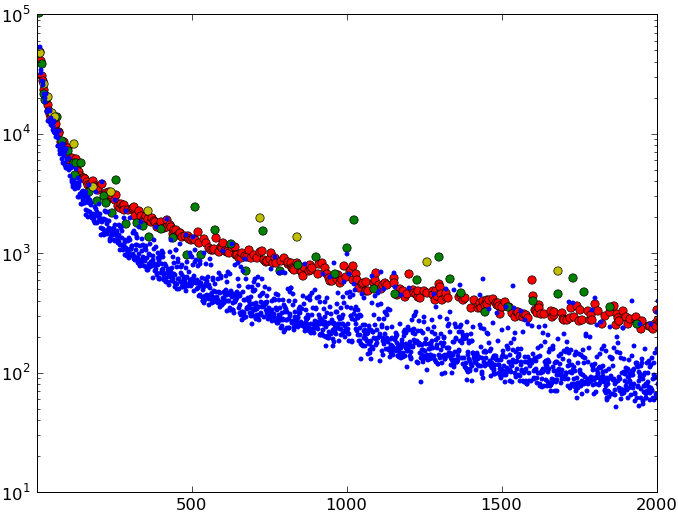

# Sloane's gap

Data and code corresponding to my discovery of a gap in the distribution of the occurences of integer numbers in [The On-Line Encyclopedia of Integer Sequences (OEIS)](https://oeis.org/).

 

 
## References

1. Ph. Guglielmetti, [Chasse aux nombres acratopèges](https://www.drgoulu.com/2008/08/24/nombres-acratopeges/), 24 August 2008, drgoulu.com
2. Ph. Guglielmetti, [La minéralisation des nombres](https://www.drgoulu.com/2009/04/18/nombres-mineralises), 18 April 2009, drgoulu.com
3. Jean-Paul Delahaye, [Mille collections de nombres](https://www.pourlascience.fr/sd/mathematiques/mille-collections-de-nombres-1093.php), Pour la Science N°379 – mai 2009, p 88-93 
4. Ph. Guglielmetti, [Le fossé de Sloane](https://www.drgoulu.com/2011/04/10/le-fosse-de-sloane/), 10 April 2011, drgoulu.com
5. Nicolas Gauvrit, Jean-Paul Delahaye et Hector Zenil, « Le fossé de Sloane », Mathématiques et sciences humaines, 194 | Eté 2011
6. Nicolas Gauvrit, Jean-Paul Delahaye, Hector Zenil, “Sloane’s Gap. Mathematical and Social Factors Explain the Distribution of Numbers in the OEIS“, 2011, [arXiv:1101.4470](https://arxiv.org/abs/1101.4470)
7. Nicolas J.-P. Gauvrit, Jean-Paul Delahaye, & Hector Zenil (2013). Sloane’s Gap: Do Mathematical and Social Factors Explain the Distribution of Numbers in the OEIS? Journal of Humanistic Mathematics, 3 (1), 3-16 [DOI: 10.5642/jhummath.201301.03](https://scholarship.claremont.edu/jhm/vol3/iss1/3/)
8. [Frequency of appearance in the OEIS database](https://oeis.org/wiki/Frequency_of_appearance_in_the_OEIS_database) OEIS Wiki,
9. André Deledicq, Mickaël Launay, "Dictionnaire amoureux des mathématiques", Plon, 2001, ISBN 9782259264860, pp.316-320